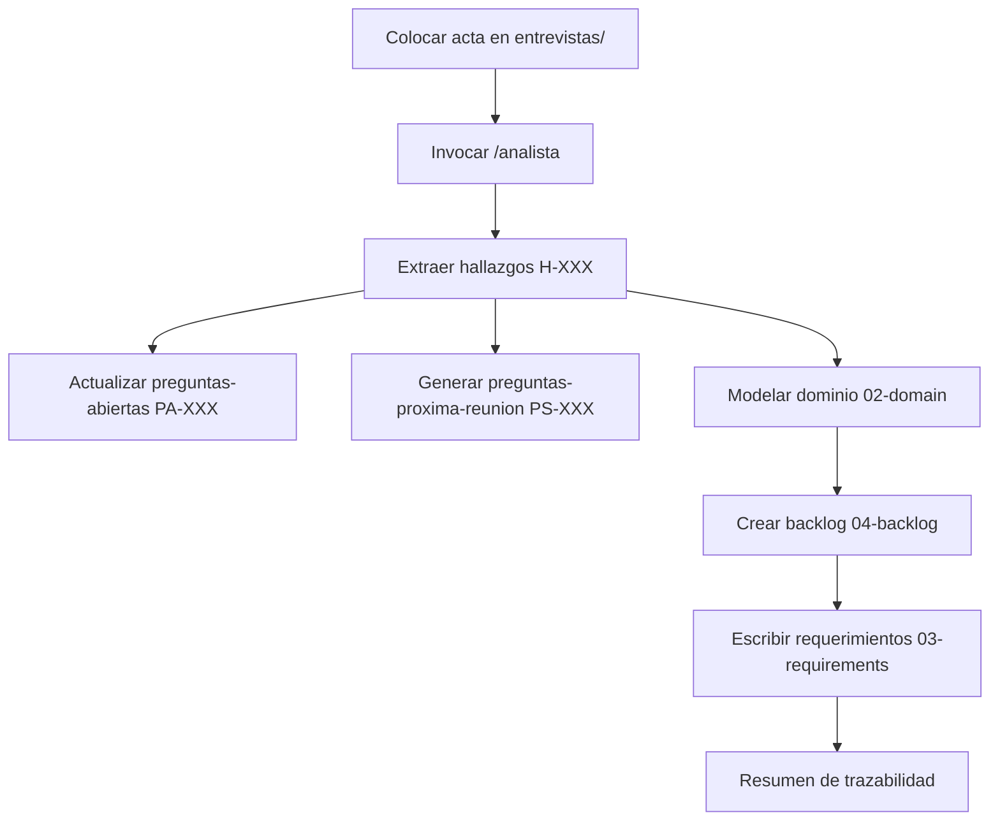

# Uso del Subagente Analista (Cursor)

Guía para procesar actas de entrevista y generar requerimientos estructurados con trazabilidad completa.

---

## ¿Qué hace?

El subagente **analista** transforma actas de entrevista del cliente en artefactos de `knowledge-base/`:

| Salida | Ubicación | IDs |
|--------|-----------|-----|
| Hallazgos | Acta en `01-discovery/entrevistas/` | `H-XXX` |
| Preguntas abiertas | `01-discovery/preguntas-abiertas.md` | `PA-XXX` |
| Preguntas para próxima reunión | `01-discovery/preguntas-proxima-reunion.md` | `PS-XXX` |
| Actores, entidades, reglas | `02-domain/` | `ACT-`, `ENT-`, `RN-`, `EVN-` |
| Épicas y features | `04-backlog/` | `EP-`, `FEAT-` |
| Casos de uso, historias, criterios | `03-requirements/` | `CU-`, `HU-`, `CA-` |

**No genera código.** Solo documentación de requerimientos.

---

## Prerrequisitos

1. Tener el acta de entrevista en Markdown:

```
knowledge-base/01-discovery/entrevistas/entrevista-001.md
```

2. Formato mínimo del acta:

```markdown
# Entrevista 001
Fecha: 2026-07-08
Participantes: Cliente, Analista

## Notas de la reunión

[Transcripción o notas de lo conversado]
```

3. Reglas del proyecto cargadas (automático en Cursor):
   - `.cursor/rules/AI_PROJECT_RULES.md`
   - Subagente en `.cursor/agents/analista.md`

---

## Cómo invocarlo

### Opción 1: Comando directo (recomendado)

En el chat de Cursor Agent:

```
/analista Procesa el acta en knowledge-base/01-discovery/entrevistas/entrevista-001.md y genera todos los artefactos siguiendo AI_PROJECT_RULES.md
```

### Opción 2: Lenguaje natural

```
Usa el subagente analista para analizar knowledge-base/01-discovery/entrevistas/entrevista-001.md
```

### Opción 3: Delegación automática

Si describes una tarea de análisis de entrevista, Cursor puede delegar al analista automáticamente gracias a su `description` en el frontmatter.

Ejemplo:

```
Tengo una nueva entrevista con el cliente sobre el módulo de cervezas. Analízala y genera los requerimientos.
```

---

## Flujo completo (paso a paso)



### 1. Preparar la entrevista

Crea el archivo con notas o transcripción:

```powershell
# Ejemplo de ruta
knowledge-base/01-discovery/entrevistas/entrevista-002.md
```

### 2. Ejecutar el análisis

```
/analista Procesa knowledge-base/01-discovery/entrevistas/entrevista-002.md
```

### 3. Revisar entregables

| Archivo | Qué revisar |
|---------|-------------|
| `entrevistas/entrevista-002.md` | Hallazgos `H-XXX` agregados al acta |
| `preguntas-abiertas.md` | Dudas pendientes de validar (`PA-XXX`) |
| `preguntas-proxima-reunion.md` | Preguntas sugeridas para la siguiente reunión (`PS-XXX`) |
| `02-domain/*.md` | Actores, entidades, reglas nuevas o actualizadas |
| `04-backlog/epicas.md`, `features.md` | Épicas y features vinculadas |
| `03-requirements/` | Casos de uso, historias, criterios Gherkin |

### 4. Validar trazabilidad

Cada historia (`HU-XXX`) debe poder rastrearse:

```
Entrevista → H-XXX → RN-XXX → ENT-XXX → EP-XXX → FEAT-XXX → HU-XXX → CA-XXX
```

### 5. Próxima reunión con el cliente

1. Usar `preguntas-proxima-reunion.md` como guía de la reunión
2. Registrar respuestas en una nueva entrevista (`entrevista-003.md`)
3. Volver a invocar `/analista` con la nueva acta
4. Marcar `PA-XXX` respondidas en `preguntas-abiertas.md`

---

## Ejemplos de prompts

### Análisis completo

```
/analista Procesa knowledge-base/01-discovery/entrevistas/entrevista-001.md y genera:
- Hallazgos en el acta
- Preguntas abiertas y sugeridas para próxima reunión
- Dominio, backlog, historias y criterios Gherkin
Todo según AI_PROJECT_RULES.md
```

### Solo preguntas para próxima reunión

```
/analista Lee entrevista-001.md y actualiza solo preguntas-abiertas.md y preguntas-proxima-reunion.md
```

### Continuar desde entrevista anterior

```
/analista Procesa entrevista-002.md. Marca como Respondidas las PA-XXX que ya se contestaron según el acta y regenera las preguntas para la próxima reunión.
```

---

## Qué NO debe hacer el analista

| Prohibido | Motivo |
|-----------|--------|
| Escribir en `src/` | Es trabajo del agente de desarrollo |
| Inventar reglas sin hallazgo | Viola trazabilidad |
| Crear historias sin RN/ENT/ACT | Viola AI_PROJECT_RULES |
| Modificar `cSharp-rules.md` | Reglas técnicas separadas |

Para implementar código a partir de los requerimientos, usa el **agente principal** (no el analista) con `cSharp-rules.md`.

---

## Archivos de configuración

| Archivo | Rol |
|---------|-----|
| `.cursor/agents/analista.md` | Definición del subagente (prompt + metadata) |
| `.cursor/rules/AI_PROJECT_RULES.md` | Metodología y formatos de artefactos |
| `.opencode/agents/analista.md` | Equivalente para OpenCode (formato distinto) |

---

## Troubleshooting

| Problema | Solución |
|----------|----------|
| El subagente no aparece | Verificar que existe `.cursor/agents/analista.md` |
| Escribe código en `src/` | Indicar explícitamente: "solo knowledge-base, sin código" |
| IDs duplicados | Pedir que lea artefactos existentes antes de asignar IDs |
| Preguntas genéricas | Pedir preguntas `PS-XXX` concretas vinculadas a `H-XXX` |
| Falta trazabilidad | Pedir matriz de trazabilidad en el resumen final |

---

## Referencias

- [Cursor Subagents docs](https://cursor.com/docs/subagents)
- `.cursor/rules/AI_PROJECT_RULES.md` — reglas maestras del proyecto
- `README.md` — sección Knowledge Base y subagente analista
