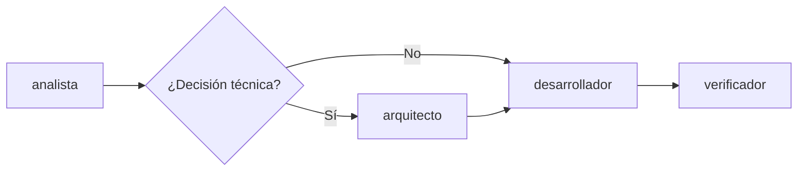

# Uso de Subagentes — Desarrollador, Arquitecto y Verificador

Guía para los subagentes de implementación, consultoría técnica y validación en Cursor.

---

## Cadena completa del proyecto



---

## Subagente: arquitecto

### ¿Qué hace?

- Responde consultas sobre **tecnologías, patrones de diseño y arquitectura**
- Presenta **2–4 alternativas** con **pros, contras, esfuerzo y alineación** con el proyecto
- Da una **sugerencia no vinculante** — **el usuario siempre decide**
- Documenta decisiones aceptadas como **ADR** en `knowledge-base/05-architecture/adr/`

### ¿Qué NO hace?

- No implementa código (`/desarrollador`)
- No genera requerimientos de negocio (`/analista`)
- No impone decisiones sin confirmación del usuario

### Ejemplos de invocación

```
/arquitecto ¿Conviene usar CQRS para el módulo de posts? Presenta pros y contras para este proyecto.

/arquitecto Compara PostgreSQL vs SQL Server para nuestro caso. No implementes, solo asesora.

/arquitecto El usuario eligió Redis para cache. Documenta la decisión como ADR-001.
```

### Formato de respuesta esperado

El arquitecto entrega alternativas comparadas, tabla resumen y pregunta explícita: *¿Qué opción prefieres?*

Tras tu decisión, puede crear el ADR:

```
knowledge-base/05-architecture/adr/ADR-001-redis-cache.md
```

---

## Subagente: desarrollador

### ¿Qué hace?

Implementa historias (`HU-XXX`) y criterios Gherkin (`CA-XXX`) en `src/` siguiendo `cSharp-rules.md`:

- Entidad, DTO, Service, Controller
- Validador FluentValidation, AutoMapper, DI
- Migración EF si aplica

### Prerrequisitos

- Historia documentada en `03-requirements/historias/`
- Criterios en `03-requirements/criterios/`
- Reglas de negocio en `02-domain/reglas-negocio.md`
- Si hay decisión técnica nueva → ADR aceptado por el arquitecto

### Ejemplos de invocación

```
/desarrollador Implementa HU-001 y CA-001 según cSharp-rules.md

/desarrollador Agrega el CRUD de la entidad definida en ENT-005, trazable a HU-003
```

### Si faltan requerimientos

El desarrollador **se detiene** y recomienda usar `/analista` primero.

---

## Subagente: verificador

### ¿Qué hace?

Valida en **solo lectura** que la implementación cumple:

- Criterios Gherkin (`CA-XXX`)
- Checklist CRUD de `cSharp-rules.md`
- Convenciones REST (HATEOAS, códigos HTTP, `ApiResponse<T>`)
- Trazabilidad HU → código
- Build (si puede ejecutarlo)

### Cuándo usarlo

- Después de que el desarrollador termine una HU
- Antes de merge o deploy
- Cuando quieras confirmar que algo "está realmente completo"

### Ejemplos de invocación

```
/verificador Confirma que HU-001 y CA-001 están implementados correctamente

/verificador Revisa el UserController contra cSharp-rules.md
```

### Resultado

Reporte con severidad: **Crítico | Alto | Medio | Bajo** y veredicto:

- `APROBADO`
- `APROBADO CON OBSERVACIONES`
- `RECHAZADO`

---

## Flujo de ejemplo completo

### 1. Análisis (analista)

```
/analista Procesa entrevista-001.md
```

### 2. Consulta técnica (arquitecto) — opcional

```
/arquitecto Para notificaciones en tiempo real, ¿SignalR o polling? Pros y contras.
```

Usuario responde: *"Elijo SignalR"*

```
/arquitecto Documenta ADR-001 para SignalR según mi decisión
```

### 3. Implementación (desarrollador)

```
/desarrollador Implementa HU-002 y CA-002 siguiendo ADR-001 y cSharp-rules.md
```

### 4. Validación (verificador)

```
/verificador Valida HU-002, CA-002 y cumplimiento de ADR-001
```

---

## Separación de responsabilidades

| Subagente | Escribe en | No toca |
|-----------|------------|---------|
| analista | `knowledge-base/` (01–04, 07) | `src/` |
| arquitecto | `knowledge-base/05-architecture/`, `06-decisions/` | `src/` |
| desarrollador | `src/` | `knowledge-base/` |
| verificador | nada (`readonly`) | — |

---

## Archivos de configuración

| Archivo | Rol |
|---------|-----|
| `.cursor/agents/arquitecto.md` | Prompt del arquitecto |
| `.cursor/agents/desarrollador.md` | Prompt del desarrollador |
| `.cursor/agents/verificador.md` | Prompt del verificador |
| `.cursor/rules/cSharp-rules.md` | Reglas técnicas (desarrollador + verificador) |
| `.cursor/rules/AI_PROJECT_RULES.md` | Trazabilidad (todos) |

---

## Troubleshooting

| Problema | Solución |
|----------|----------|
| Desarrollador inventa reglas | Exigir HU/RN documentados; usar `/analista` |
| Arquitecto implementa código | Recordar: solo asesora y documenta ADRs |
| Verificador modifica archivos | Tiene `readonly: true`; pedir solo reporte |
| Decisión técnica sin ADR | Pedir al arquitecto documentar tras tu elección |
